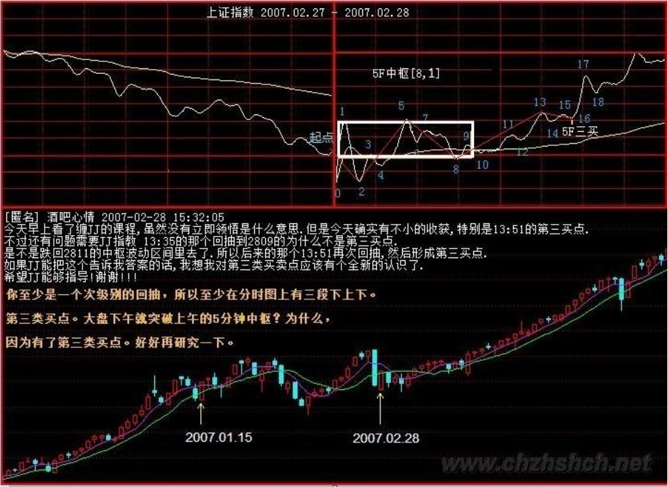

# 教你炒股票 32：走势的当下与投资者的思维方式
(2007-02-28 08:44:37)
***
在股票市场做投资，投资人最大的毛病，就是只有一种思维方式，把自己的喜好当成了市场的现实。按照这种逻辑， 在股票市场， 做多的人， 就永远要做多； 做空的人， 就永远要做空； 如果真是这样， 那不是有毛病吗？好象这次春节前的大盘走势，为什么要做多？ 因为从技术上来看，上证指数有在日线上形成中枢第二段走势的要求，这就是做多的客观条件； 而当这第二段走势出现背弛了，就意味着做多的客观条件就没有了，继续硬撑着不是有毛病吗？ 股票市场的牛市是快跌慢涨、熊市是快涨慢跌，这最基本的市场节奏，大家不应该不知道吧？ 有一种更坏的毛病， 就是股票涨了才高兴，股票一跌就哭着脸。

请问： 如果对股票只做多，怎么才能够把持股的成本降为 0 呢？股票都是废纸，如果庄家只让股票涨只做多， 庄家永远是顶着一个雷。 本 ID 在前面的文章里已经多次强调过了，只有持有 0 成本的股票才是真正安全的。如果你死多死空的思维模式不改变， 那么，你永远都是股票的奴隶。 而且，跌完以后涨得最快的股票是哪些股票呢？就是跌出了日线上的第三类买点来的那些股票。 看看 000416（ 民生投资） 上次的那一跌， 就跌出了一个完美的日线上的第三类买点，后面就是一个月时间完成了 100%幅度的上涨，中间还带了一周的假期。

如果股票市场大跌，就把你的眼睛放大，去找会形成日线上的第三类买点的股票，这才是股票操作真正的节奏与思维。 本 ID 的理论里没有风险的概念，风险是一个不可操作的上帝式概念。 本 ID 的眼里只有买点、卖点，只有背驰与否，这些都是有严格定义的、可操作的，这才是让股票当你奴隶的唯一途径。 有人可能要反问本 ID，你不是说中国的地盘中国人做主吗？请问，难道中国人做主，就只能是做多的主？如果不能是做空的主， 这还算做的什么主呢？如果你把握了本 ID 的理论，严格按买点买、卖点卖，那你就是股票的主人。

所谓汉奸，不过是希望通过他们的伎俩来把中国的血给吸走，而如果你有本事让汉奸低卖高买，那汉奸就死定了。就像这次股票市场调整， 你去问问在中国联通（ 600050） 上的汉奸们吧，是谁吃了哑巴亏呢？ 前面本 ID 说过， 本 ID 在 N 年前干过的一个阻击， 股价从 14 元一直阻击上 25 元， 然后全部出掉， 时间也是在春节前后的事，算起来也就 10 来个交易日， 没有用一分钱来拉抬，为什么？就是因为本 ID 把某些人的节奏给搞乱了。 大家应该记得赵本山和范伟在有一年的春节联欢晚会上演的小品《卖拐》里的那场对话吧， 情节有点类似。

具体怎么样，以后和大家说如何阻击的时候再说。不过， 可以告诉大家最终的结果，那股票最终跌回到 3 元多了。 炒股票如同跳舞，关键是节奏，节奏一错，就没法弄了。 买点买、卖点卖，就是一个最合拍的节奏； 任何不符合这个节奏的操作，都肯定是要出乱子的。 例如，你是按 30 分钟级别来操作的人， 你所持仓的股票在 30 分钟级别的走势上明明出现顶背驰了，你不卖， 你还老是想着这股票还要涨； 而这股票却跌个不停，你心里就不断后悔，股票越跌，你越怕它再跌，等到跌得差不多了，这时你心里的承受能力也达到极限了， 然后在底背驰出现的时候却终于忍不住了，杀出去了； 如果你这样反复操作几次， 这样下来，你很快就不用玩股票了， 因为股票很快就玩死你了。

股票的走势，是有其节奏的，你操作股票，如同和股票跳舞，你和股票必须跳到心灵相通；也就是本 ID 在前面说的，和那股票走势的合力一致；这样才是顺势而为，才是出色的舞者。如果还不明白的人，今天去跳一下舞， 找一个舞伴，把他/她的节奏当成股票的节奏，感应一下。 舞蹈节奏的感应，是当下的； 如果当下你还想着前后，那你一定跳不好舞。股票也一样，永远只有当下的走势状态； 股票的走势，没有一个必然的、上帝式的意义，所有走势的意义都是当下赋予的。

例如，一个 30 分钟的 a+A+b+B+c 的向上走势，你不可能在 A 走出来后就说一定会有 B； 这样等于是在预测，等于假设一种神秘的力量在确保 B 的必然存在，而这是不可能的。那么，怎么知道在 b 段里是走还是不走呢？这很简单，这不需要预测，因为在 b 段是否要走掉， 这不是由你的喜好来决定的，而是由 b 段当下的走势来决定的。如果 b 段和 a 段相比，出现了明显的盘整背驰，那就意味着要走； 否则，就不走。而参考 b 段的 5 分钟以及 1 分钟图，你会明确地感觉到这 b 段是如何生长出来的。

这就构成了一个当下的结构，只要这个当下的结构没有出现任何符合区间套背驰条件的走势，那么就一直等待着，走势自然会在 30 分钟图上延伸出足够的力度，使得背驰成为不可能。这都是自然发生的，无须你去预测。 再详细说说，在上面的例子中，在 30 分钟的 a+A+b+B+c 里， A 是已出现的走势类型，是一个 30 分钟级别的中枢，这可以用定义严格判别，没有任何含糊、预测的地方。而在 b 段走势里， 一定不可以出现 30 分钟级别的中枢，也就是只能出现最多是 5 分钟级别的中枢。

如果在 b 段走势里的一个 5 分钟级别的开始上涨就已经使得 30 分钟的图表上不可能出现背驰的情况，那么，你就可以有足够的时间去等待走势的延伸，等待它形成一个 5 分钟的中枢， 一直到这 5 分钟的走势出现背驰； 这样就意味着 B 要出现了，一个 30 分钟级别的新中枢要出现了。是否要走，这和你的资金量及操作级别有关了； 如果你喜欢做短线，你可以走一点货，等这个 30 分钟中枢的第一段走势出现背驰后回补筹码； 在这个 30 分钟中枢的第二段走势的高点看 5 分钟或 1 分钟的背弛出去， 等这个 30 分钟中枢的第三段走势下来再回补筹码。

然后就看这个 30 分钟中枢能否继续向上突破， 走出 c 段来。注意， c 段走势并不是天经地义一定要有的，就像 a 段走势也不是天经地义一定要有的一样。要出现 c 段走势，如同要出现 b 段走势一样，都必须有一个针对 30 分钟中枢的第三类买点出现，这样才会有。所以，你的操作就很简单了； 每次5 分钟的走势向上离开 30 分钟中枢后，一旦顶背驰出现，就要先出来； 然后， 如果一个 5 分钟级别的走势回拉不回到 30 分钟中枢里，就意味着有第三类买点了，那就要回补筹码，等待 c 段走势出现。而 c 段走势和 b 段走势的操作方法是一样的，是否要走，完全可以按当下的走势来判断，无须任何的预测。 如果不背驰，就意味着还有第三个 30 分钟中枢出现，以此类推。

显然，上面的操作，不需要你去预测什么，只要你能感应到走势当下的节奏，而这种感应也没有任何的神秘，就是会按定义去看而已。 那么， 在 30分钟的 a+A+b+B+c 里，这里的 B 一定是 A 的级别？ 如果问这样的问题，同样是不理解走势的当下性。当走势处于 a+A+b 时，你是不可能知道 B 的级别的； 只是，只要 b 不背驰，那 B 至少和 A 同级别， 但 B 完全有可能比 A 的级别大； 那这时候，就不能说 a+A+b+B+c 就是某级别的上涨了，而是 a+A+b成为一个 a'，成为 a'+B 的意义了。但是，无论是何种意义，在当下的操作中都没有任何困难。

例如，当 B 扩展成日线中枢时，那么，就要按日线中枢的级别来探究其操作的意义了； 其后如果有 c 段，那么， 就要用日线级别的走势的标准来看其背驰了，这一切都是当下的。至于中枢的扩展，其程序都有严格的定义，按照定义操作就行了。 股票在中枢里震荡时，是最容易打短差降成本的了，关键是要利用好各种次级别的走势的背驰或盘整背驰来操作就可以了。所以， 对股票走势的一切预测， 都是没意义的。而对股票走势的当下的感应和及时反应才是最重要的事情。你必须能随时读懂股票市场的信号，这是对应用本 ID 理论的人的最基础也是最根本的一点要求。

如果你连股票市场的信号、 股票走势的节奏都读不懂， 说其他的一切东西都是无意义的。 但是，还有一点很重要，就是你虽然读懂了股票市场发出的信号，但却不按股票市场发出的信号来操作，那这就是你思维上的问题了； 老有着侥幸心理，这样也是无意义的。 按照区间套的原则， 股票市场的走势， 一直可以追究到盘口的信息里； 如果在一个符合区间套原则的背驰中发现盘口的异动，那么，你就能在最精确的转折点操作成功。本 ID 的理论不废一法，盘口工夫同样可以结合到本理论中来的，但关键是要把这盘口功夫用在恰当的地方，而不是任何的盘口异动都是有意义的。

本 ID 的理论由于是从市场的根子上来考察市场，所以，只要你把握了，你就可以结合各种理论，什么基本面、政策面、资金面、庄家等等因数来指导你的股票操作操作，这些因数如何起作用、有效与否，都会在这股票市场的基本走势框架上反应出来。 由于股票市场的走势是当下的，那么，炒股的人具有的思维也应该是当下的； 而任何习惯于幻想的人，都是把幻想当成当下而掩盖了对当下真实走势的感应。 在这股票市场谋生， 最关键的事情就是要有正确的操作，而不是吹嘘、预测。有人可能要反问，怎么缠师你这里也经常说些类似预测、吹嘘的话呢？

例如， 前两天本 ID 说让汉奸砸盘中国联通（ 600050）。请问，汉奸可能有几十亿股中国联通的筹码吗？汉奸砸盘本 ID 就要接？本 ID 为什么不可以先砸？为什么一定要在顶背弛出现时接砸盘的筹码？本 ID 又没毛病，汉奸如果有爱好，最好在底背弛的时候砸盘，本 ID 一定欢迎。而对于本 ID 来说，如果有些话能当百万雄兵，本 ID 凭什么不说？本 ID 也没兴趣知道， 中国联通昨天在 9： 36 到 9： 45 推升出 5.52 元的价位， 是谁中风了，竟然勇敢地顶出一个顶背弛来了； 在那时候，本 ID 只看到了卖点，如此而已。就算不知道本 ID 的理论，最简单的判断方法，难道连 1 月 4 日和 1 月 30 日的连线在哪里都看不清楚？ 所有非汉奸、非奸细的各位请注意了， 来本 ID 博客这里的奸细少不了，如果你把这里当成一个纯粹的课堂，那就太小看这里了。

但是， 有一点是无疑的，就是一旦你掌了握本 ID 的炒股理论后，你炒股票， 根本就无须再听任何人的话了；无论谁的话、 任何话， 都是废话， 股票的走势永远第一正确。牛顿不能违反万有引力定律，本 ID 也不能违反本 ID 的理论，这才是最关键的地方。而只有这样，才有可能有一个正确的思维基础。你无须尊重本 ID， 甚至，你学会了本 ID 的理论，还可以专门和本 ID 作对，企图在市场上挣本 ID 的钱； 但你必须尊重本 ID 的理论，就像你必须尊重万有引力定律一样，否则， 市场的走势每分每秒都会给你足够的教训。

### 解盘及回复：

>缠师：今天之所以如此早就发课程了，就是想让各位现场学习。 让各位看看上证指数的走势是如何从 a+A+b+B+c 演变成 a'+B 的；在高位卖了股票的人，如果在今天早上不敢回补，那么，在今天下午 13： 51 的时候，在第三类买点出现时，怎么都应该回补了。而且， 个股与大盘的节奏不同，这两天深圳低价本地股表现怎样，今天是哪个板块先涨停的，除非你的眼睛有毛病， 否则， 大概都应该能看明白了。如果今早没看到课程的人，那么就好好对照上证指数这两天的 1 分钟图研究一下。如果把本课程吃透了，那你的缠论水平就可以上初二了。

>大盘在后面的走势很简单，就是看上证指数 2915 点、即昨天一分钟中枢的高点能否冲得过去。如果看不懂的人，就看 5 日线。 如果上不去，那就要二次探底了，否则这走势就形成 V 型反转， 上证指数就要重新攻击 3000 点了。 至于个股方面，没什么可说的，今天的课程里专门让大家去找有第三类买点的股票：“ 大跌，就把眼睛放大，去找会形成第三类买点的股票，这才是股票操作真正的节奏与思维。”不仅是思维本身，心态如何调整，有了这次现场直播，大家对这节奏，不知道有没有感觉。今天一早看课程又能理解的人，有福了。 2007-02-28 15:15:26

*网友[匿名] 老新手：第二个 1 分钟中枢形成，就看后面是否背驰了。 2007-02-28 09:53:25*

>网友[匿名]CCTV：不一定，你仔细研究一下妹妹今天举的两个例子。我觉得，大盘还存在一种可能，就是形成妹妹文章里说的 a'+B，然后突破 B 直接上去。现在应该按 a'+B 来看了。 2007-02-28 10:24:40

>缠师：表扬一下 CCTV，为了这几句话：不一定，你仔细研究一下妹妹今天举的两个例子。我觉得，大盘还存在一种可能，就是形成妹妹文章里说的a'+B，然后突破 B 直接上去。现在应该按 a'+B 来看了。

>缠师： 股票市场的任何走势都是最好的免费训练， 光纸上谈兵是没用的，关键是要实际操作； 操作，要心手合一才可以，否则就是浪费时间。 股票市场只认识走势本身，其他的一切东西都是多余的；不经过一番修炼，是不能成器的， 各位就好自为之吧。今天早点把文章贴出来，也希望各位在这股票市场的大震荡中，能有一个顿悟。 这样，就真的对得起这市场的震荡与本 ID 的这篇文章了。 2007-02-28 08:50:44

*1. 网友[匿名] CCTV：第二个 1 分钟中枢形成，就看后面是否背驰了。 2007-02-28 08:50:44*
>网友[匿名] 老新手：不一定，你仔细研究一下妹妹今天举的两个例子。 2007-02-28 10:24:40
>网友[匿名] CCTV： 我觉得，大盘还存在一种可能，就是形成妹妹文章里说的 a'+B，然后突破 B 直接上去。现在应该按 a'+B 来看了。 2007-02-28 10:20:59

*2. 网友 [匿名] 水房姑娘： 现在开始炒垃圾股了，是否行情到第三波了？要玩完了？ 2007-02-28 15:21:18*
>缠师：就算是第三波，也是第一大波里的第三波。这轮牛市，走个 10 年 8 年有什么奇怪的？上一次牛市，一共走了 13、 14 年。

*3. 网友 [匿名] 小鸟： 上证指数现在是 5 分钟中枢的第一段吧？ 2007-02-28 15:16:28*
>缠师：现在上证指数的走势很简单。今天早上就是一个 5 分钟的中枢，下午出现第三类买点后离开这个 5 分钟中枢。现在问题的关键，就是在上面是否能再出现一个 5 分钟中枢。如果这中枢能站稳 5 天均线以及 2915 点，那么就可以期待再冲 3000 了。如果不行，那就下来形成一个 30 分钟的中枢。

*4. 网友[匿名] 酒吧心情 ：上证指数在下午 13： 35 的那个回抽，到 2809 点，为什么不是第三买点？是不是跌回 2811 点的中枢波动区间里去了？所以，后来的那个13：51再次回抽，然后形成第三买点？如果 JJ能告诉我这个问题的答案的话，我想我对第三类买卖点应该有个全新的认识了。2007-02-2815:32:05*
>缠师： 这个 5 分钟中枢的第三类买点的形成，至少需要一个次级别的回抽，所以， 至少在分时图上要有下、 上、 下三段走势。

*5. 网友 [匿名] 满目山河： 缠妹妹真是出其不意啊， 哪知道这么早就出新文章了啊。刚来，才看到。缠妹妹教我们是不是有点着急啊？我倒是希望早点看到全部课程， 期待中。 2007-02-28 15:32:45*
>缠师：这种现场版本，现场看，印象更深。事后看，即使不管那些说闲话的人，对大家的理解也不太好。今天没看到的人，只能看已经形成的图形去想象那种现场气氛了。

*6. 网友 [匿名] 快：现在应该说，第一个 5 分钟中枢快完成了吧？ 2007-02-28 15:35:27*
>缠师：你还没理解今天的课程。 你说的这个 5 分钟中枢，在早上就已经形成了，而下午出现了第三类买点，那就确认这个中枢结束了。

*7. 网友[匿名] 小鸟：再一次体会不做预测，只看市场走势的当下！这和我事先估计的情况完全不一样。 2007-02-28 15:37:06*
>缠师：预测其实也是可以的， 但你要把所有可能出现的情况都列清楚。像本 ID 今天现场直播上证指数今天的走势， 你没想到，所以就漏掉了。其实，所有的情况，基本就是你预测的那种， 以及今天直播的这种。 如果把这些情况弄清楚了， 你的缠论水平就可以上初二了。继续努力吧。

*8. 网友 [匿名] 小鸟：要看明天是否形成第二个 5 分钟中枢并且是否站稳，是吗？ 2007-02-28 15:42:27*
>缠师：如果你的股票操作技术还可以的话，就可以利用中枢的震荡弄点对冲。例如 5 日线冲不破， 就先出来。跌回来，不出现单边下跌的情况，能形成中枢的走势，再把已经抛出去的筹码补回来。当然，这都要看具体的个股的走势情况了，有些股票走得强，已经出现上涨走势了，那直接看个股的背驰就可以了。 股票操作技术不行的人，就操作少点。先研究清楚了再说。

*9. 网友 [匿名] 惊鸿一慕：谢谢缠姐姐的理论。昨天在 26.67 元把 600888（ 新疆众和） 卖了，进入日线背驰段立即清仓！今天下午在 23.60 元又全部补回来了，赚了 13％，真爽！缠姐姐，今天 600888 的低位买点形成了第三类买点，我的理解正确嘛？ 2007-02-28 15:44:33*
>缠师：这只能算依然在中枢里的震荡。这个中枢的级别很大，一旦往上突破， 上涨的空间不小。短线就看什么时候突破了， 确认以一个至少是日线上的第三类买点为标准。可以参考一下 600432（ 吉恩锡业） 在 22 元那次回抽，不过那个中枢没这个大，突破起来就比较轻松。

*网友 [匿名] 瞎鼓捣：假如在 30 分钟级别的买点进入的人，是不是要等 30 分钟级别的背弛出现了才出货？ 有没有不等到 30 分钟级别的背弛出现，走势就发生了转折的情况呢？ 如果有这种情况该怎么操作？ 2007-02-28 15:52:33*
>缠师：你还没理解本课程。如果一个股票的走势是 a+A+b+B+c 的情况，那自然就是要等到这股票的走势出现 30 分钟级别的背驰了才出货。如果这股票的走势演化成了 a`+B 的情况，那可能就是一个最低级别的背驰就引发出了一个 B，然后跌破或升破这个 B； 在这个时候时，出货就不一定要等什么 30分钟级别的背驰了。因为这时候的 B 已经是日线级别以上的中枢了， 这就要按这个大的中枢来判断走势了。好好理解一下，这是两种不同的情况。后面还有课程详细分析这种情况，不过可以先自己思考一下。

*11. 网友 [匿名] 也许认识你： 在第 3 类买点出来后，上涨了一段，然后直接就跌下来了，跌到前面的那个中枢，这种情况应该怎么处理？*
>缠师： **如果根据本 ID 的理论来操作， 上涨这一段如果出现了背驰，那你早就该出来了，等不到下跌的时候。如果不出现背驰，就至少会形成一个新的中枢在上面， 这就更不存在任何问题了**。

*12. 网友 [匿名] 后知后觉：承蒙禅主关照，今天的第三类买点看到了， 也把握到了。也在群里跟同学们说了， 只是买的股票还没起来。 2007-02-28*
>缠师： 具体的买卖操作，你要根据所选股票自身的走势情况来决定进出，大盘的走势只能是参考。一般来说，只要大盘不是单边下跌， 那二、三线个股受大盘的影响不会太大。

*13. 网友 [匿名] 箭梦弦歌：在 a`+B 形成过程中，我唯一的依据是盘整的回抽越来越高，所以认为可能不会跌破本中枢，直到第三类买点形成，才最终确认 a+B 形成了。我的这个想法对吗？ 2007-02-28 15:56:25*
>缠师： 中枢 B 中的走势，也有次级别的。一样可以用背驰之类的方法来决定买卖点。 盘整其实可以很简单的处理，就是按次级别的走势来看就行了，进行一段一段的分解操作。当然，有些特别小级别的走势，就没必要操作了。

*14. 网友 [匿名] 大盘：请问博主，为什么不可以认为上证指数的走势，从今年 1 月以来，到目前为止， 都还是在今年 1 月份形成的日线中枢里震荡延伸呢？不是每次 30 分钟上升后又 30 分钟回抽到中枢里吗？日线中枢的扩展，不是要前后两个不重叠的日线中枢的震荡，高低点有瞬间重合才算吗？我怎么觉得，好多股票，目前都是第一个日线中枢延伸呢？中枢延伸的低点，和发生转折是根据什么来判断？也是根据延伸段内，次级别的背驰来判断吗？对这些问题，还比较迷惑。 2007-02-28 16:01:36*
>缠师： 中枢的延伸， 不能超过 9 个次级别的走势，否则就变成更大级别的中枢了， 这根据定义是很容易理解的。例如， 9 个 30 分钟级别的走势的延伸，每三个 30 分钟级别的走势， 又构成一个日线级别的走势，三个日线级别的走势， 自然就构成周线级别的走势了。你可以数数，现在究竟有多少个 30分钟级别的走势了，已经足够形成周线中枢了。注意，如果股价是一条直线上涨或下跌的，没波动的情况，那是不能这样算的。例如，直接封涨停的情况，就只能算是最多 1 分钟级别的走势。因为要构成更大级别的中枢， 就首先要有走势的波动， 没有走势的波动， 就不存在中枢的扩展、延伸的问题。

*网友总书记：一个股票的走势，如果走出了某级别的中枢 A，就一定能有 b 吗？如果在 A 里面就发生了反转呢？首先，走出 b 的条件是什么？ 还有，现在上证指数是不是在一个五分钟的 A 内？ 那前面的 a 也就只有一个中枢了？ 2007-02-28 16:03:47*
>缠师：上面不是已经反复说了？ 要从中枢 A 里走出 b 的条件，就是必须走出中枢 A 的第三类买点。 上证指数在今天下午就突破了上午形成的 5 分钟中枢了。 为什么，因为有了 5 分钟的第三类买点了， 好好再研究一下。

*16. 网友 [匿名] 大盘：请问博主，关于中枢扩展的问题。例如， 在一个 5 分钟级别的 a+A+b+B+c 的走势里， 第 2 个 5 分钟中枢 B 后面的 c 段出现了顶背驰，随后的下跌把第二个 5 分钟中枢 B 扩展成了一个 30 分钟级别的中枢。如果随后的下跌特别厉害，不仅跌破了第一个 5 分钟中枢 A 的高点 ZG或者震荡的高高点 GG，而且还跌破了前面已经有的一个日线中枢的高点 ZG 或者震荡的高高点 GG，是不是这种情况，日线中枢就直接扩展成周线中枢了呢？还是仍然算是日线中枢的延伸呢？ 2007-02-28 16:10:38*
>缠师： 一个股票的走势，出现了 5 分钟的背驰是否要走，你要根据当时这个股票的 30 分钟的走势、日线的走势、甚至周线的走势，等等级别的走势情况来看。如果大级别的走势仍然处在主升段上，就算走了，在回跌后也要买回来。如果这个 5 分钟的背驰， 符合区间套的情况，那就不能随便买回来了。所以， 根本不存在跌回来了怎么办的问题， 因为那时候，你需要考虑的是买不买，而不是卖不卖的问题了。别把节奏搞错了。

*17. 网友 [匿名] 三藏：老大，你今天说上证指数后面的走势很简单，就是看上证指数 2915 点， 即昨天一分种中枢的高点。如果看不懂的人，就看 5日线。 如果上不去，那就要二次探底了。这段话的原理是什么啊？为什么没站住 ZG 就会再次下跌呢？就是这探底的原理我不知道。老大麻烦解释一下。2007-02-28 16:19:04*
>缠师：每个中枢的 GG、 DD 都是最重要的位置之一，都会产生阻力或支持，原理要等在以后的课程里再说了。

*18. 网友[匿名] 淡定： 楼主好啊！今天郁闷了一天。我昨天偏偏进了汉奸围剿的重灾区了， 上证指数大跌的那天还进了 000001（ 深发展）， 现在该如何是好啊？*
>缠师：元旦以后， 本 ID 就一直不让来这里的人碰这类股票了。都说请在二、三线股里，找有买点的股票来买。如果买了，只能等着了， 最晚下半年会起来的。

*19. 网友 [匿名] 努力学习： 000938（ 紫光股份） 今天震荡的幅度达到了 9%， 可惜高位没走。 2007-03-01 15:46:34*
>缠师：有卖点就要出，别整天事后才后悔，这样永远学不好炒股技术的。

*20. 网友 [匿名] 人寿：缠妹妹对中国人寿（ 601628） 这么痛恨？ 要把它的股价打到 20 元， 那我可就惨了。 中国平安（ 601318） 今天上市好像定价比较低，后市妹妹怎么看？ 2007-03-01 16:04:29*
>网友代缠师回答： 中国人寿（ 601628）的股价，现在是被空方主控着，而且最重要的是，战略投资者们手中还有一大批低成本的筹码等着套现，要等这些人走得差不多了， 才能大起。不过，这股票中线问题不大， 有就拿着，找机会在下面补点仓， 就解套挣钱了。

*21. 网友 [匿名] i3618：请教博主，是否在３０分钟中枢下出现第三类卖点，就要继续向下呢？理论上有可能出现第三类买点吗？ 2007-03-0115:55:00*
>缠师： 第三类买点，只能是在中枢上面才会出现的。 中枢震荡的处理很简单，就是通过看次级别的走势背驰来弄对冲。 当然，最好就是找有大级别的第三类买点的强势股票来操作，这样，大盘只要不是一天内大幅下跌，一般都很安全。

*22. 网友 [匿名] 后知后觉： 禅主，虽然有人问过了， 我还想问一下：今天上市的中国平安（ 600318），您怎么看？ 当然不是技术上的事， 希望您给予指点。*
>缠师：其实，你只要真明白了本 ID 在前面讲的课程，这些问题都很简单了。 这股票， 现在在 48 元附近有一个小中枢，能否上去形成一个大中枢，就是能否短线走强的关键。 在没出现这个大中枢之前，基本不用关注。等在下面形成中枢后，如果是短线的操作，就找一个短线底背驰介入。从中线看，这个位置套不住人。

*23. 网友[匿名]yh：缠姐，我又有问题了。对于 a'+B，既然此 a'已非彼 a，此 B 也非彼 B。为何不跳高一个级别直接看成 a+A 呢？这样理解对吗？*
>网友代缠师回答：此时的 B 还不知是会什么级别的中枢。可以是彼 B，也可以扩展成非彼 B 的高一级别的中枢 A。把 a'看成高一级别的 a 可以， 但在还没有高一级别的中枢 A 时，彼 B 暂不能看成高一级别的中枢 A。

*网友[匿名]yh：谢谢你的回答。不过， 我所说的是在 a+A+b+B+c 已经确定失效的情况下， 就像昨天的上证指数，在出现 1 分钟的第 3 类买点时， 这时我们虽然不能判定未来的走势，但是可以对 a'+B 有所预期。其实，我所提的问题， 只是个纯概念的问题， 就是为什么要定义成 a'+B，而不定义成高级别的 a+A？这样通用性不是更好吗？*

>缠师：确实，写成 a`+A`是最好的。不过，关键是要明白意思。

*24. 网友 [匿名] 兰兰：缠姐好！精确的定义我都看了，还有一些不明白之处，请姐姐指点。从前一两天的上证指数的走势来看，分时图和 1 分钟图差不多，下跌第一个 1 分钟中枢可以认为是 5 分钟中枢吗？第 2 个是 5 分钟中枢也是 1 分钟中枢吗？分时图没有 MACD 看背驰，是看成交量吗？姐姐的博客人气已经很旺了，特别是姐姐回答问题的时候， 我经常刷不出画面。翻页也快，都插不上几句话。 2007-03-01 16:31:25*

>缠师：不能。 5 分钟的中枢， 必须是有三个 1 分钟级别的走势类型的重叠部分存在。而 1 分钟的走势类型，怎么都至少有一个 1 分钟的中枢存在。如果你把 1 分钟的走势当成最低级别的走势，那至少要有三根 K 线的重叠部分存在。有些庄家在某些个股上的连续拉抬或者打压， 那种直上直下的走势，就没有 K 线的重叠部分存在，所以不能看成是中枢。 MACD 就是 MACD，和成交量没什么关系。

*25. 网友[匿名] dliss：我觉得，对于新手来说，最好不要做超短线。还是多看看日 K 线图，先找感觉，把各种各样的图形形态了然于胸才可以。缠mm，我说得对吗？ 2007-03-01 16:34:04*
>缠师：对。太短线的走势， 稍微反应慢点， 就把买卖点错过了， 很难把握。最短线的操作， 也要 5 分钟以上级别的，最好是 30 分钟以上级别的。

*26. 网友步点： 大跌真可怕。今天辛辛苦苦去抄底，补回前几天卖出的股票，不料到收盘时还是整体跌了 1%。剩下的银子，等到上证指数跌到 2600点时再补。 2007-03-01*
>缠师：昨天怎么不补？而且，回补股票，不是随便补的，最好是回补在日线上有第三类买点的那些股票。

*27. 网友 [匿名] 瞎鼓捣：看了老大的文章爽啊！请问一分钟以下的背弛怎么分辨？ 2007-03-01 16:39:26*
>缠师：看分时图。或者看 1 分钟图上的 MACD，直接看红绿柱子，不看黄白线。

*28. 网友 [匿名] 小鸟：妹妹，我觉得今天上证指数的 1 分钟走势， 怎么和昨天的走势是一样的啊？ 只是级别更低，下跌时 a+A+b+B+c 因为 b 背驰了，所以转化为 a~+B。请问是这样的吗？ 2007-03-01 15:54:33*
>网友代缠师回答： 上证指数昨天下午的走势， 是 1 分钟级别的上涨，昨天收盘前是一个 1 分钟以下级别的顶背驰。今天早上 10： 06 附近，是一个 1分钟以下级别的底背驰， 然后出现一个大的中枢，上下震荡， 收盘勉强拉回这个中枢。明天，如果上证指数在这中枢下，出现第三类卖点，那就会继续探下去。否则， 依然围绕这中枢震荡。

