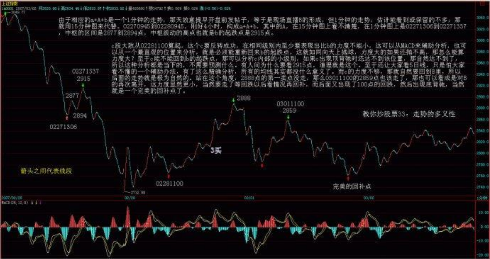
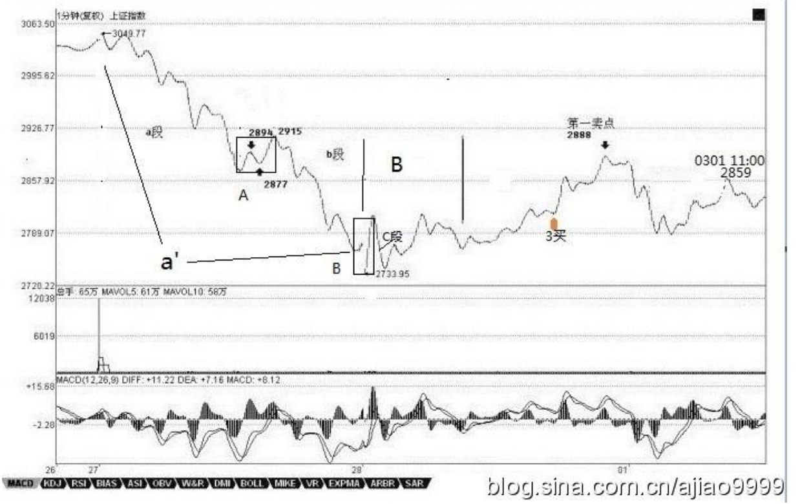
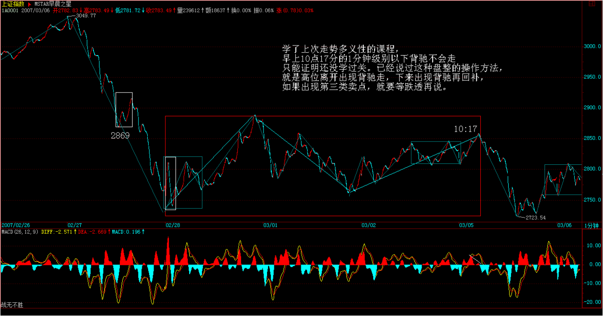
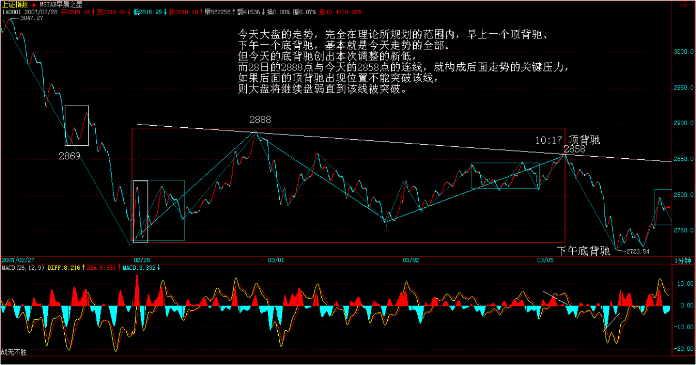
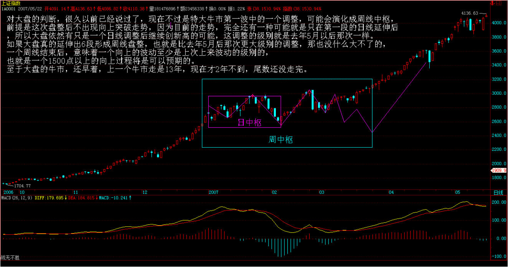
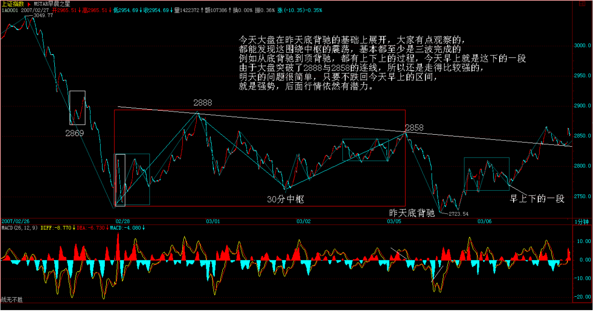
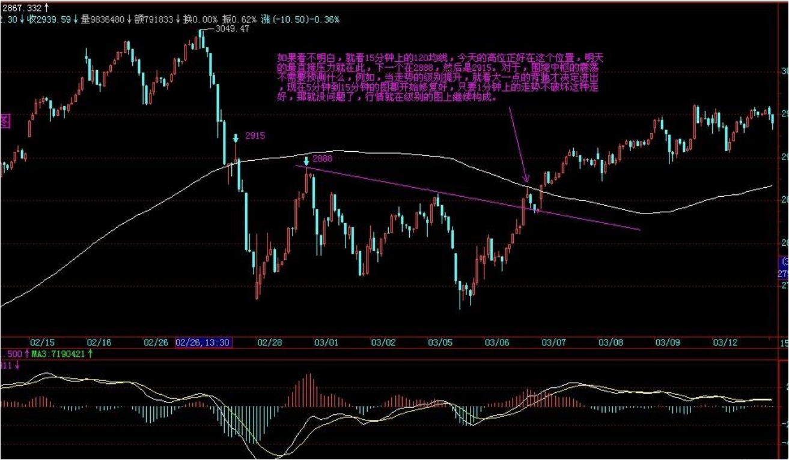
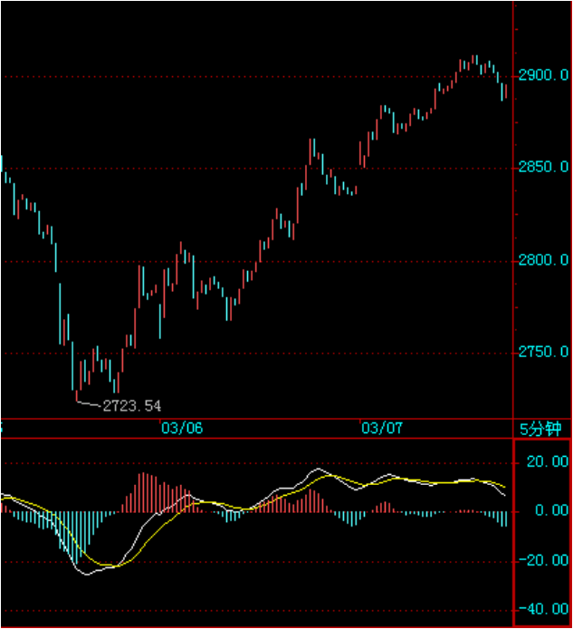
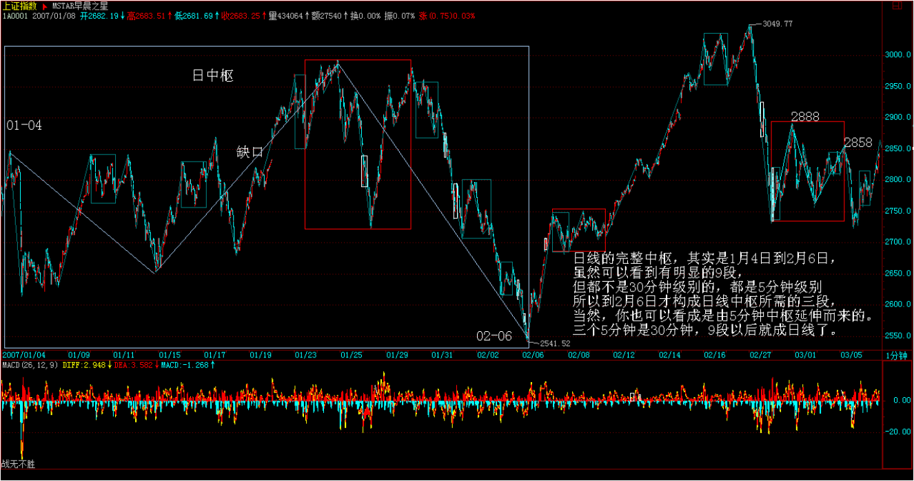
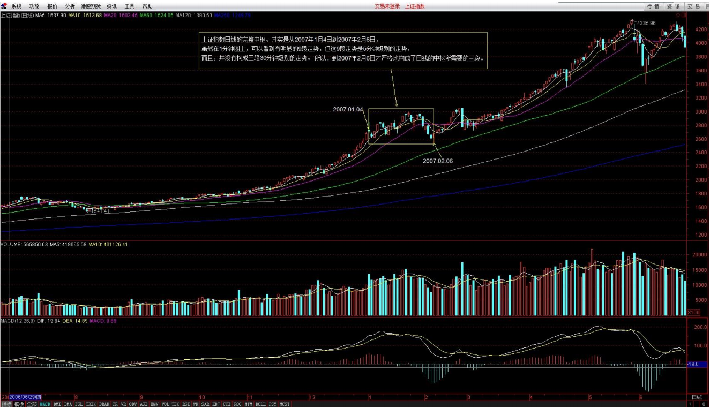

# 教你炒股票 33：走势的多义性
(2007-03-02 15:20:37)
***
如果股票市场的走势， 都是标准的 a+A+b+B+c 的模式， 中枢 A、 B 的级别都一样，那这股票市场的走势也太标准、太不好玩了。 股票市场的真实走势，总是有其复杂的地方，使得这市场的走势， 呈现出了一种多义性， 这就好象诗词中文字的多义性一样。如果诗词中的文字， 没有多意义性，诗词都如逻辑一样，那也太没意思了。

而在股票市场， 所有走势的多义性，都与中枢有关。例如， 一个 5 分钟级别的中枢不断延伸， 总计出现了 9 段以上的 5 分钟级别的次级别的走势（ 即出现 9 段以上的 1 分钟级别的走势）， 那么， 站在 30 分钟级别的中枢这个角度来看这个情况， 3 个 5 分钟级别的走势重合就形成了， 从而就构成了一个 30 分钟级别的中枢。

而 9 段以上的 1 分钟级别的走势，每 3 段就可构成一个 5 分钟的中枢，这样也就可以解释成这是一个 30 分钟级别的中枢了。这种情况，只要对中枢延伸的数量进行限制，就可以消除走势的多义性； 一般来说，中枢的延伸不能超过 5 段，也就是一旦出现第 6 段的延伸，加上已经形成中枢本身的那三段次级别的走势，就构成更大级别的中枢了。

另外一种走势的多义性，是因为模本的简略造成的； 不同级别的走势图，其实就是对股票市场的真实走势之不同精度的一种模本。例如，一个年线的走势图， 当然没有 1 个分笔走势图的精确度高；市场走势变化的很多重要的细节， 都不可能在大级别的走势图里看到。而所谓走势的级别，从最严格的意义上说， 是可以从每笔成交构成的最低级别的图形上不断按照中枢延伸、扩展等的定义精确地确认出来的。

这是最精确的走势描述，不涉及什么 5 分钟线、 30 分钟线、日线等； 但这样做会相当累， 在股票的实际操作中也没这个必要。用 1 分钟线、 5 分钟线、30 分钟线、日线、周线、月线、季线、年线等的级别来安排，只是一个对市场走势的简略的描述方式； 最主要原因还是，从现有的证券交易系统上，可以查到的走势图， 都是这样安排的。当然，有些系统可以按不同的分钟数显示图形； 例如，弄一个 7 分钟的走势图，这都是完全可以。

这样，你完全可以按照某个等比数列来弄出一个市场走势的级别序列； 不过，可以是可以，但没有这个必要。因为， 这对图形的精确性来说并没有太大的实际意义。 真实的股票市场的走势， 并不需要通过如此精确的图形来观察。当然， 一些简单的图形指标的数据变动也是可以接受的，例如去掉 30分钟图，换成 15 分钟图和 60 分钟图，形成 1 分钟、 5 分钟、 15 分钟、 60 分钟、日线、周线、月线、季线、年线的级别安排，这也是可以的。 虽然没有必要精确地从最低级别的图表开始逐级往上分析，但如果你看的图表的缩放功能比较好， 当你把分笔图或 1 分钟图不断缩小，这样， 你看到的走势就会越来越多，而这种从细部到全体的逐步呈现，会对走势级别的不断扩张有一个很直观的感觉。

这种感觉，对你以后形成一种市场直觉是有帮助的。在某个阶段，你可能会形成这样一种直觉； 你如同站在重重叠叠的走势连绵中，而当下的趋向，仿佛照亮着层层叠叠的走势；那时候，你往往可以忘记中枢之类的概念；所有的中枢，按照各自的级别，仿佛都变成大小不同的迷宫关口； 而真正的路只有一条，而你的心直观当下地感应着。

说实在的， 只有当你有了这种对股票市场的走势有如此清晰的直觉时， 对本 ID 的炒股理论的掌握成度， 才算到了入门阶段。那时候，就如同看一首诗，如果还从语法等去分析，就如同还用中枢等去分析股票的走势一样；而真正的有感觉的读者，是不会计较于各种字句的纠缠的； 整体的直观当下就呈现了，一首诗就如同一自足的世界，你当下就全部拥有了。

对于股票市场上的走势的直观，其实也是一样的。只要那最细微的苗头一出来，就当下地领悟了，这才算是对股票市场走势这伟大诗篇的一个有点合格的阅读了。 在一个能充分直观的阅读者眼里， 诗词、文章的多义性是不存在的；而在股票市场， 当市场的参与者应该具有的这种最敏锐的直觉还没出现时，对市场走势的多义性的分析， 依然是必要的，因此也必须继续。

换句话说，如果你玩不了超逻辑的游戏，那你就只能继续在逻辑的圈子里晃悠。除了上面两种多义性之外，还有一种有实质意义的多义性，也就是在对股票的走势分析中的多种合理的释义； 这些释义都符合本 ID 理论的内在逻辑，因此，这种多义性反而不是负担，而是可以用多角度来对股票走势进行一个综合的分析。

例如，对 a+A+b+B+c， a 完全可以有另一种释义，就是把 a 看成是围绕 A 这个中枢的一个波动，虽然 A 其实是后来才出现的，但不影响这种看法的意义。同样 c 也可以看成是针对 B 的一个波动，这样， 整个走势其实就简化为两个中枢与连接两者的一个走势了。在最极端的情况下，在 a+A+b+B+c 的走势系列类型里， a 和 c 并不是必然存在的，而 b 完全可以是一个跳空缺口； 这样，整个走势就可以简化为两个孤零零的中枢了。

把这种看法推广到所有的走势中，那么， 任何股票的走势图，其实就是一些级别大小不同的中枢了； 把这些中枢看成是不同的星球，在当下的位置上的星球对应着当下的位置， 产生向上的力， 在当下的位置下的星球对当下的位置，产生向下的力，而所有这些力的合力，就构成了一个总的力量； 而股票市场当下的力，也就是当下的买卖产生的力，买是向上的力，卖是向下的力，这也就构成了一个合力； 前一个合力是股票市场已有的走势构成的一个当下的力，后者是当下的交易产生的力； 而研究这两种力之间的关系，就构成了市场研究的另一个角度，也就是另一种释义的过程。这是一个复
杂的问题，以后会陆续说到， 这算是本 ID 理论在高中阶段的课程了。

现在先别管什么力不力的了，可以从纯粹中枢的角度对背驰给出另外的释义。 对 a+A+b+B+c，背驰的大概意思就是 c 段的力度比 b 段的力度小了。那么，站在 B 这个中枢的角度，不妨先假设 b+B+c 是一个向上的过程，那么 b 可以看成是向下离开中枢 B，而 c 可以看成是向上离开中枢 B。所谓顶背驰，就是在最后这个中枢的位置， 走势向上离开的力度比向下离开的力度要弱。

而中枢有这样的特性，就是对无论向上或向下的离开，都有相同的回拉作用； 既然走势向上离开中枢的力度要比向下离开中枢的力度要弱，而向下离开都能拉回中枢，那向上的离开当然也能拉回中枢里了。 对于 b+B+c 向上的走势，这就构成了顶背驰； 而对于 b+B+c 向下的走势， 这就构成了底背驰。对于盘整背驰，这种分析也一样有效。其实，站在中枢的角度，盘整背驰与背驰，本质上是一样的，只是力度、级别以及发生的中枢位置不同而已。

同样，站在纯中枢的角度来考察， 在 a+A+b+B 这种走势类型中，其中， 中枢 B 的级别大于中枢 A 的级别这种情况就很简单了；在这个时候，并不必然地在中枢 B 出现之后，后面的走势就一定会接着原来的方向继续前进的，而是可以进行相反的方向运行的。例如， a+A+b+B 是向下的，而 a+A+b 其实可以看成是对中枢 B 一个向上离开的回拉； 而对中枢来说，并没有要求所有的离开都必须按照上下上下的次序。

一次向上的离开后再一次向上的离开，完全是被允许的； 那么， 站在这个角度，从中枢 B 直接反转向上，就是很自然的了。那么，这个反转是否成功，不妨把这个后续的反转写成 c，那么也只要比较一下 a+A+b 与 c 这两段的力度就可以了。 因为中枢 B 对这两段的回拉力度是一样的，如果 c 比 a+A+b弱，那当然反转不成功； 这也就意味着走势一定要重新回到中枢 B 里， 即使就是在走势最强的情况下， 也至少有一次回拉去确认能否构成一个第三类买点。

而 a+A+b 与 c 的力度比较，与背驰的情况没什么分别，只是两者的方向不同而已。如果用 MACD 指标来辅助判别， 进行背驰比较的黄白线和柱子面积都在 0 轴的一个方向上，例如都在上面或下面，而 a+A+b 与 c 就分别在不同的方向上； 由于这个原因，也就不存在黄白线回拉的问题了，但有一点是肯定的，就是黄白线至少要穿越一次 0 轴。这几天大盘的走势，就是对这种情况的一个最标准的演示，简略分析如下。

由于相应的 a+A+b 是一个 1 分钟的走势，那天本 ID 故意提早在开盘前发帖子，等于是在现场直播中枢 B 的形成； 但那天上证指数的 1 分钟的走势，估计当时能看到或者能够把这 1 分钟的走势图保留下来的人不多，那就用 15 分钟的走势图来代替吧。 2007.02.27.09:45 到 2007.02.28.09:45，刚好 4个小时，构成 a+A+b 走势，其中的中枢 A，在 15 分钟图上看不清楚，在 1 分钟图上是 2007.02.27.13:06 到 2007.02.27.13:37，中枢的区间是上证指数 2877 点到 2894 点， 此中枢波动的高点、 也就是构成中枢的 b 段走势的起跌点是 2915 点。

构成此中枢的 c 段走势大致是从 2007.02.28.11:00 算起，这个 c 段走势若要反转成功， c 段走势在和 b 段走势相同的级别内， 至少要表现出比 b 段走势的力度不能小； 这可以从 MACD 指标来辅助分析，也可以从一个最直观的位置来分析， 就是这走势必须能重新回来 b 段的起跌点； 这就如同向天上抛球， 你力度大的动作如果还抛不高，那怎么才能算你的力度大？

至于 c 段走势能不能回到 b 段走势的起跌点，那可以分析 c 内部的小级别的走势； 如果在 c 段走势出现顶背驰时还达不到该位置，那就自然达不到了；所以， 这种分析都是当下的，不需要预测什么。有人问为什么要看上证指数的 2915 点，道理就在这里。至于还让大家看 5 日线， 那只是怕大家看不懂时给你们指出的一个判断上证指数的走势的辅助办法。

有了上面对股票的走势中的中枢运动进行这么精确的分析之后， 在股票走势图上的所有的均线系统， 其实都没什么意义了。而 c 段走势的力度不够，那就自然要回到中枢 B 里了，所以， 在后面出现的走势就是极为自然的了。站在这个角度， 上证指数在 2888 点的第一卖点没走，那么，在2007.03.01.11:00 时的 2859 点也该走了，那也可以看成是对 B 的再次离开， 这力度显然更小了； 当然， 走了就要等回跌以后， 看情况再回补，而后面又出现了 100 点的回跌，然后出现底背驰，当然，这就是一个完美的回补点了。

总体上来说， 围绕中枢的震荡操作原则是很简单的，每次向下离开中枢只要出现底背驰，那就可以介入了； 然后看相应回拉出现顶背驰的位置是否能超越前面一个向上离开的顶背驰高点； 如果不行，就一定要走，行也可以走，但次级别回抽一旦不重新回到中枢里， 那就意味着第三类买点出现了，就一定要买回来。

而如果从底背驰开始的次级别回拉不能重新回到中枢里，那就意味着第三类卖点出现了， 这就必须要走了，然后等待下面去形成新的中枢来重复类似的过程； 围绕中枢的震荡操作，其实也就是这么简单，真没什么复杂的。当然， 如果没有本 ID 的理论指导， 对股票的走势是不可能有如此精确的分析的； 这就像没有牛顿的理论，人们只能用神话去讲述一切关于星星的故事一样。

不过， 上面这些分析都是针对上证指数的来说的，而个股的情况必须具体分析；很多个股，只要指数不单边下跌，就会活跃，不爱搭理指数； 所以，大家在个股上的操作， 不能完全按指数来弄。其实， 对于指数，最大的利益是在股指期货里。不过， 股指期货的情况有很大的特殊性，因为期货是可以随时开仓的，和股票交易凭证数量的基本稳定不同，所以， 在力度分析等方面有很多不同的地方，这在以后再说。

### 解盘及回复：
>缠师： 今天， 军工股意料之中的利好， 使得打击汉奸又多了一重利器，中信银行的 IPO 即将发行，使得汉奸对金融股的打压也不再肆无忌惮了。目前，这股票市场的关键是心理层面的修复，通过震荡把不坚定分子洗干净。上证指数的技术走势，有了今天的课程，自己就可以分析了。如果看不明白，那还是看 5 日线。 两会结束是一个敏感时间，下周初是一个心理敏感时间，因为听说汉奸和面首都有周经现象。

>个股没什么可说的。 现在，本 ID 的炒股理论学得多了，就要自己去找股票来操作，不要扎堆在本 ID 说的几只股票上。 虽然本 ID 不介意操作难度加大，但这样其实是害了大家。自己凭本事找到的东西， 才是最好吃的东西；本 ID 的理论，只是找吃的方法。 在低价股里，像科技（包括 3G）、旅游等等历史上活跃的板块，都是找好股票的板块。

>但选股票， 一定要按技术指标来选，选择那些在日线上有第三类买点的股票，或至少是刚从日线的第三类买点起来的股票介入，这样才比较安全。估计现在 000999（ 三九药业） 没几个人有了，被抛下车的人也不用伤心，你们的水平和某著名的、有着汉奸名字的基金一样，有数以千万计的筹码因为被赎回而丢失了。这简直是太令人高兴的事情了， 600343（ 航天动力） 的情况也一样，就是要害一下这些汉奸。但汉奸还有筹码，本 ID 现在就是要挑逗他们， 让他们最好都砸出来。 2007-03-02 15:21:10

>学了《 走势多义的性》这一课程，早上 10 点 17 分的 1 分钟级别以下背驰不会走的人，只能证明你还没学懂。 本 ID 已经说过了，**对于这种盘整走势的操作方法，就是高位离开出现背驰走，下来出现背驰再回补，如果出现第三类卖点，就要等跌透再说**。 2007-03-05 11:56:42

>在盘整走势中，绝对不能小看小级别的背驰，特别是那种离开中产生的背驰。 例如， 今天上证指数的一顶一底，幅度足有 130 点，很多股票的振幅超过了 10%，这就是减低成本的好机会。 上证指数在这里震荡的机会已经超过 3 次了，如果都能按技术要求把握，对于散户来说，你的成本足可以减低30%了。 在股票市场里的盘整走势， 总是占据大多数的交易时间； 不会利用盘整走势来减低成本的人，基本还是属于不入流的操作者。技术不过关的人，在盘整时完全可以离开， 等大盘走强了再说。例如， 一个周线中枢的形成，怎么都要弄好几个月，你完全可以回家抱孩子去。但真正的股市杀手，遇到盘整就是天堂； 盘整走势的操作， 往往能创造出比上涨更大的利润。抛了可以买回来，而且， 可以自如地在各板块中活动。但是，要想达到这种境界， 你必须精通本 ID 的理论， 必须经过刻苦的学习与训练。

>你如果学不了，就先离开。 本 ID 教你一种最简单的办法，就是等大盘的周线出现底背驰时再进来。 这样，你 N 年才需要看一次盘，多轻松？ 对于盘整走势的操作，就是要敢买敢卖；但一旦这走势出现了第三类卖点， 进入了破位急跌，就要等跌透了，有一点级别的底背驰出现了再进入； 这样操作，才能既避开了下跌，又不浪费盘整时的震荡机会。 如果技术不熟练的人，就减少仓位操作。大盘现在没什么可说的， 大盘的走势，现在是一个绝佳的练习盘整操作的运动场，要珍惜。

>缠师：今天，上证指数的走势在昨天底背驰的基础上展开，对上证指数的走势有点观察的人，都能发现这围绕中枢的震荡，基本都至少是三波完成的。例如， 从底背驰到顶背驰，都有上下上的过程，今天早上就是这下的一段。由于上证指数突破了 2888 点与 2858 点的连线，所以还是走得比较强的，明天的问题很简单，只要不跌回今天早上的区间，就是强势，后面的行情依然有潜力。 2007-03-06 15:22:36

>个股方面，依然是板块轮动。 中信银行的新股要发行上市了，汉奸不敢乱砸金融股了， 大盘所以就起来了， 事情就是这么简单。 而且， 今天的金融股还有稳定大盘的任务，毕竟香港的股市最近也不太平。散户没必要理会这些东西，根据当下的走势来操作就可以了。 注意，板块轮动很快，千万不能追高买股，应该找没动的有买点的股票来买，这样才能占据先机。

*1. 网友[匿名] 咕咚：缠姐好！下面是您对大势的评价：“对大盘的判断，很久以前已经说过了，现在不过是特大型牛市行情中第一波牛市行情中的一个调整，可能会演化成周线中枢，前提是这次盘整后不出现向上突破走势； 因为目前的走势，完全还有一种可能，就是只在第一段的日线延伸后……”缠姐， 你所指的“第一段的日线”具体为哪一段？ 2007-03-06 16:16:48*

>缠师： 上证指数日线的完整中枢。其实是从 2007 年 1 月 4 日到 2007 年 2 月 6 日，虽然在 1 分钟图上， 可以看到有明显的 9 段走势，但这 9 段走势是5 分钟级别的走势，而且，并没有构成三段 30 分钟级别的走势。所以， 到 2007 年 2 月 6 日，上证指数才走出了构成日线中枢所需要的三段次级别的走势。当然，你也可以把这个日线中枢看成是由 5 分钟中枢延伸而来的。三个 5 分钟的走势构成一个 30 分钟中枢， 有了 9 段 5 分钟的走势以后， 就成日线中枢了。

 
